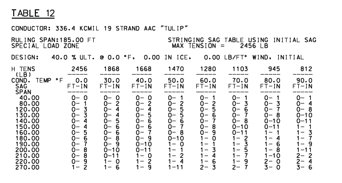
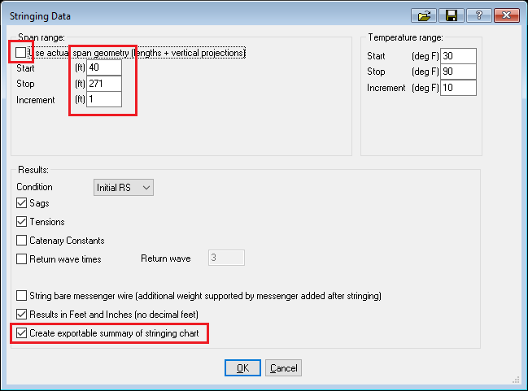
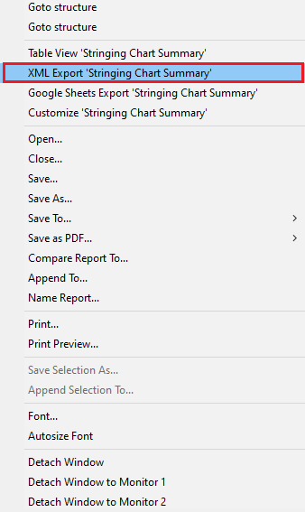
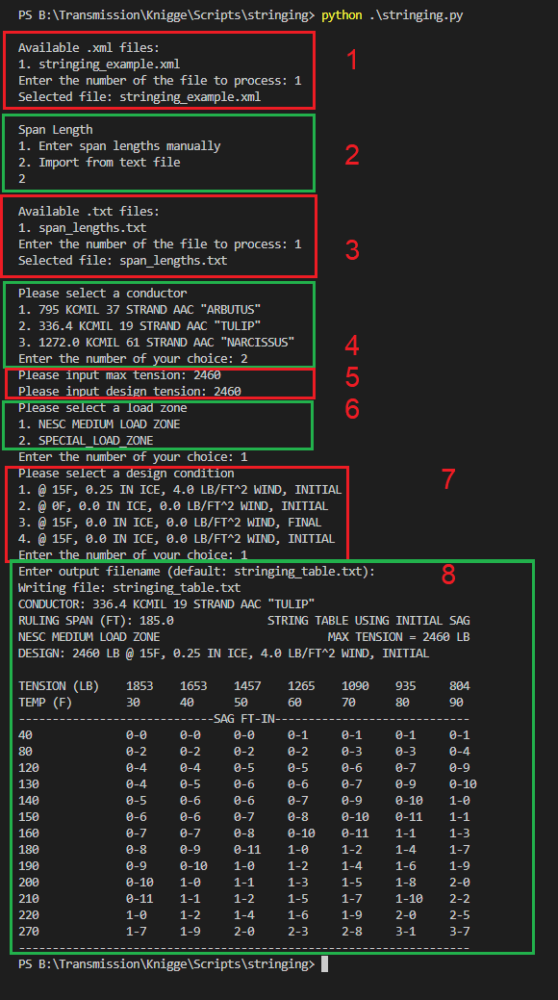

# Introduction
The purpose of this script is to format the conductor stringing data in the form of XML files generated using PLS-CADD into nicely formatted text sag-tension tables. The output is printed to the console but also creates a text file that can easily be added to a plan set and shouldn't require any additional formatting or changes. In practice, that means a drafter can simply insert this as text into a plan sheet.

# Program Variables
Many utilities use a small number of conductors, a single loading zone, and specific design conditions. As such, these values are hard-coded into the program but can easily be changed based on changes to standards or your system parameters.

| Variable | Description | 
| --- | --- |
|Conductors | List of conductors that can be selected
|Loading Zones| List of loading zones, typically a utility only spans a single loading zone
|Design Conditions| List of conditions that govern the tension values
|Sag Text| Set to ft-in but could be modified for metric units
|Print Order| Print order of the various elements in a sag table. This can be modified but may create issues with new line characters, as they have been set to print to a default order.

# Usage
This section will provide a detailed example of how to export the file and create a formatted stringing table. The files from this example are included in this repository.



This image was created using an alternate program. In this example, we will create a similar output but using PLS-CADD and the exported XML file.



When exporting the section stringing chart from PLS-CADD, note whether you want to use the actual span geometry or user-specified geometry. Generally, it's the latter. To capture the entire range for a table when you want to make sure the start and stop values include the entire range, and that the end value ends one increment after the last value. For example, if you set the increment to 1 and the end value is 270, you want to end at 271. If you used an increment of 5 and wanted to end at 100, you would stop at 105.

Also, make sure you select the option to create an exportable summary of the stringing chart.



After the chart data is created, right-click on the table export data and select the option to export to an XML file.

Place the XML file, Python script, and span lengths text file (optional) in the same directory. The span lengths text file is simply a text file with a span value that you want in the final table on each line of the text file. These values are used to filter all the values from 40-270 in this example, into the values you want to see for span lengths in the text file. This script allows you to enter them when the program is run or import them from a text file. This example shows the use of the span length text file, so it may be less straightforward than manual entry, where values are simply separated by commas.

Navigate to the directory in the shell or terminal and run the script:

```python stringing.py```


1. Choose the XML file to analyze. The script will filter so only XML files show up as options.
2. Enter the span lengths for analysis. The ruling span will be pulled from the data table so it does not need to be entered. You can enter values manually separated by commas, or import them from a text file as shown in this example.
3. The import text file option will only show text files in the script directory. Select the appropriate file.
4. Select a conductor. If the conductor you want is not listed, you can modify the script global variable to add the value you want. 
5. Input the max and design tension. Usually, these values are the same, but since they can be different, they are entered separately.
6. Select the loading zone. If the loading zone you want is not present, you can modify the loading_zone global variable to include the value you want. 
7. Select the design condition. If the design condition you want is not shown, you can modify the design_conditions global variable to include the value you want. 
8. Enter the output filename. If one is not chosen, the program will use a default value and increment the filename so that no file is overwritten.
9. The final output written to the text file is shown on the console.